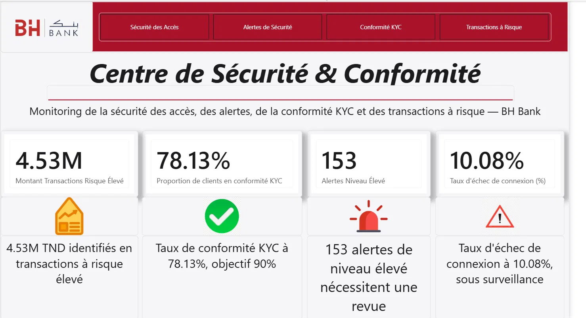
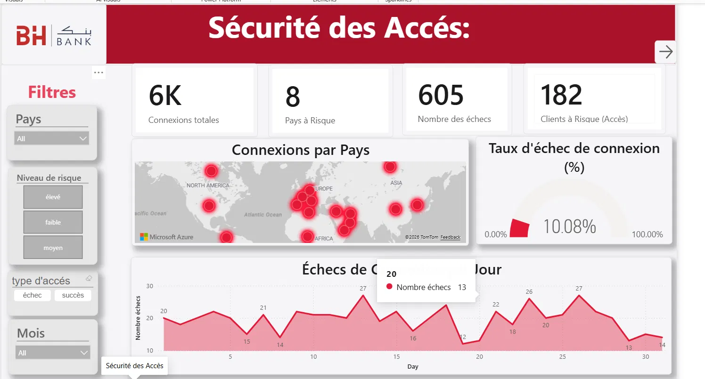
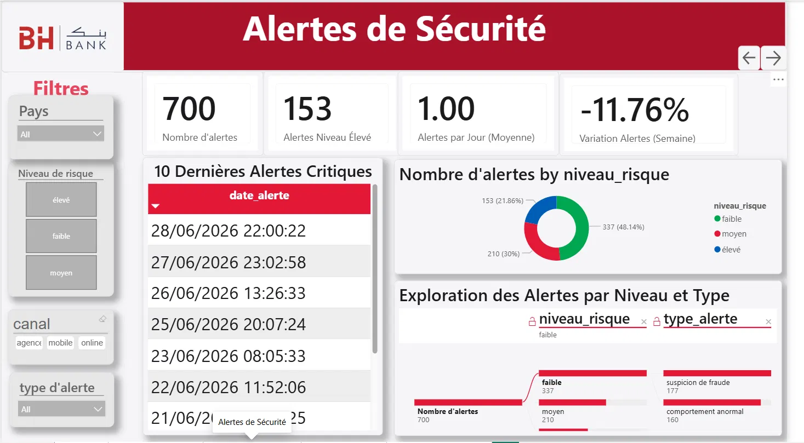
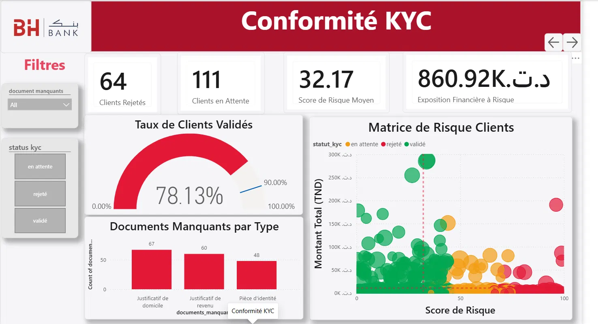
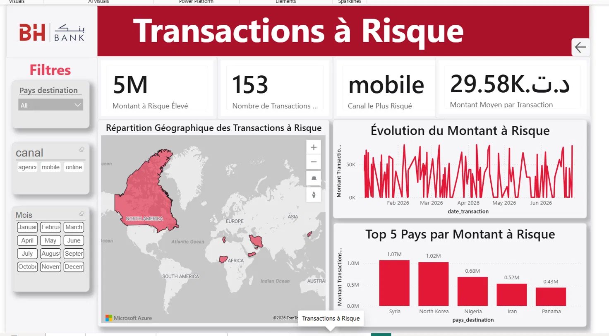

# 🏦 BH Bank — Tableau de Bord de Monitoring de la Sécurité Bancaire & Conformité KYC


---

## 👤 Informations sur l'Auteur & le Projet

- **Étudiant / Auteur** : **HOUIMELI Mortadha** (*Élève Ingénieur — ESPRIT*)
- **Organisme d'Accueil** : **BH Bank** (Banque de l'Habitat, Tunisie)
- **Établissement Académique** : **ESPRIT** (Honoris United Universities)
- **Sujet** : Tableau de Bord de Monitoring de la Sécurité Bancaire et Conformité KYC

---

## 📌 Présentation & Contexte

Ce projet s'inscrit dans le cadre du stage de fin d'études / projet académique réalisé au sein de la **BH Bank** en partenariat avec **ESPRIT**.

### 🎯 Objectif Général
Mettre en place une **solution décisionnelle bout-en-bout (Business Intelligence & Intégration Web)** permettant de surveiller et de monitorer la sécurité des transactions bancaires et la conformité **KYC** (*Know Your Customer*) dans un environnement bancaire simulé, sans dépendre d'une infrastructure ETL lourde ni de base de données relationnelle complexe.

---

## 📸 Aperçu du Tableau de Bord (Captures d'Écran)

### 1. 🏠 Page d'Accueil — Centre de Sécurité & Conformité
Page d'atterrissage principale avec cartes synthétiques, statuts d'alertes et navigation interactive in-report :



> **Indicateurs Clés de l'Accueil :**
> - **4.53M TND** — Montant Transactions Risque Élevé
> - **78.13%** — Proportion de clients en conformité KYC *(Objectif 90%)*
> - **153** — Alertes Niveau Élevé nécessitant une revue
> - **10.08%** — Taux d'échec de connexion (%)

---

### 2. 🛡️ Page Sécurité des Accès
Monitoring géographique et temporel des tentatives d'accès aux systèmes bancaires :



> **Visualisations :**
> - **Cartes KPI** : `6K` Connexions totales | `8` Pays à Risque | `605` Échecs | `182` Clients à Risque.
> - **Carte Thermique** : Cartographie mondiale des connexions suspectes.
> - **Jauge DAX** : Taux d'échec de connexion (10.08%).
> - **Graphique d'Évolution** : Échecs de connexion quotidiens (ex: Pic du Jour 20 = 13 échecs).

---

### 3. 🚨 Page Alertes de Sécurité (SIEM)
Corrélation et exploration multi-niveaux des alertes de sécurité :



> **Visualisations :**
> - **Cartes KPI** : `700` Alertes | `153` Alertes Élevées | `1.00` Alerte/Jour | `-11.76%` Variation.
> - **Donut Chart** : Répartition par risque (*337 Faible [48.14%], 210 Moyen [30%], 153 Élevé [21.86%]*).
> - **Tableau Chronologique** : Top 10 des dernières alertes critiques.
> - **Arbre de Décomposition** : Exploration des alertes (`niveau_risque` ➔ `type_alerte` : 177 suspicions de fraude, 160 comportements anormaux).

---

### 4. 📋 Page Conformité KYC (*Know Your Customer*)
Audit documentaire, scoring de risque client et statut de validation :



> **Visualisations :**
> - **Cartes KPI** : `64` Clients Rejetés | `111` Clients en Attente | `32.17` Score Risque Moyen | `860.92K TND` Exposition Risque.
> - **Jauge de Validation** : Taux de clients conformes à 78.13% *(Cible : 90%)*.
> - **Bar Chart** : Documents manquants par type (*67 Domicile, 60 Revenu, 48 Pièce d'identité*).
> - **Matrice de Risque (Nuage de points)** : Montant Total TND vs Score de Risque avec classification par statut KYC.

---

### 5. 💸 Page Transactions à Risque (AML / Anti-Blanchiment)
Surveillance des flux financiers internationaux et détection des anomalies :



> **Visualisations :**
> - **Cartes KPI** : `5M TND` Montant à Risque Élevé | `153` Transactions | `mobile` Canal le Plus Risqué | `29.58K TND` Montant Moyen.
> - **Carte des Destinations** : Flux financiers vers les pays sensibles.
> - **Courbe Chronologique** : Évolution des montants à risque (Février à Juin 2026).
> - **Top 5 Pays à Risque** : *Syrie (1.07M TND), Corée du Nord (1.02M TND), Nigeria (0.68M TND), Iran (0.52M TND), Panama (0.43M TND)*.

---

## 🏗️ Architecture Technique & Flux de Données

```
┌─────────────────┐       Export Excel       ┌────────────────────────┐
│    Mockaroo     │ ───────────────────────► │ Fichiers de Données    │
│ (Data Generator)│                          │ (securite_acces, etc.) │
└─────────────────┘                          └───────────┬────────────┘
                                                         │ Import & Modélisation
                                                         ▼
┌─────────────────────────────────────────────────────────────────────┐
│                    Power BI Desktop / Service                       │
│  - Modèle relationnel en étoile (Star Schema)                       │
│  - Mesures décisionnelles DAX avancées                              │
│  - 5 Pages de Tableau de Bord interactif (Accueil + 4 Thèmes)       │
│  - Fichier source : `stage bh without etl.pbix`                     │
└──────────────────────────────────┬──────────────────────────────────┘
                                   │
                                   │ Intégration iframe autoAuth
                                   ▼
┌─────────────────────────────────────────────────────────────────────┐
│                 Application Web d'Intégration                       │
│  - Front-End : Angular 19 SPA (`/app`)                              │
│  - Back-End  : Node.js & Express Server (`/server`)                 │
└─────────────────────────────────────────────────────────────────────┘
```

---

## 📊 Modèle de Données & Fichiers Excel (Mockaroo)

Les données bancaires ont été générées et structurées sous 4 tables principales :

| Fichier Excel | Description & Structure |
| :--- | :--- |
| **`securite_acces.xlsx`** | Journal des connexions (`id_session`, `id_utilisateur`, `date_connexion`, `type_acces` [succès/échec], `ip_source`, `pays_connexion`). |
| **`alertes_securite.xlsx`** | Événements SIEM & alertes (`id_alerte`, `id_transaction`, `niveau_risque` [faible/moyen/élevé], `type_alerte`, `date_alerte`). |
| **`conformite_kyc.xlsx`** | Audit KYC client (`id_client`, `statut_kyc` [validé/en attente/rejeté], `date_validation`, `documents_manquants`, `score_risque`). |
| **`transactions_risque.xlsx`** | Transactions financières (`id_transaction`, `id_client`, `montant`, `devise`, `canal` [mobile/online/agence], `pays_destination`, `date_transaction`). |

---

## 🚀 Application Web d'Intégration (Angular + Node.js)

- **Front-End (`/app`)** : Single-Page Application (SPA) Angular 19 avec composant d'affichage `DashboardComponent`.
- **Design System** : Charte graphique officielle BH Bank (Rouge `#E31837`, Noir `#1A1A1D`, Blanc) avec en-tête dédié et intégration du rapport Power BI (`autoAuth=true`).
- **Back-End (`/server`)** : Serveur d'hébergement statique minimal sous Node.js & Express.

---

## 📅 Journal de Bord & Chronologie du Stage (01/07 au 31/08)

```markdown
### 🟢 Juillet : Conception, Modélisation & Développement Power BI
- **01/07** : Accueil à la BH Bank, remise du sujet de stage par l'encadrant. Examen ESPRIT l’après-midi.
- **02/07 - 03/07** : Analyse du sujet, discussion sur les améliorations et génération des jeux de données bancaires via Mockaroo.
- **06/07 - 07/07** : Import Power BI, résolution des relations n:n, typage des dates & création de la première mesure DAX (taux d'échec).
- **08/07 - 10/07** : Développement de la page *Sécurité des Accès* (jauge, carte, courbe) et présentation à l'encadrant.
- **13/07 - 15/07** : Test du thème sombre ➔ Retours encadrant : passage au thème clair BH Bank et ajout de KPIs.
- **16/07 - 21/07** : Développement de la page *Alertes de Sécurité* (Donut chart, Top 10 critiques, Arbre de décomposition). Validation.
- **22/07 - 24/07** : Développement de la page *Conformité KYC* (correction granularité nuage de points) et *Transactions à Risque* (fix carte USA).
- **27/07 - 31/07** : Conception de la Page d'Accueil, vérification de la cohérence des totaux et point d'avancement.

### 🔵 Août : Optimisation, Intégration Web & Clôture
- **03/08 - 07/08** : Revue générale, ajustement des unités (K/M TND), validation des filtres et interactions croisées.
- **10/08 - 13/08** : Intégration de la navigation in-report (logo cliquable, flèches suivant/précédent), uniformisation du design et finalisation du `.pbix`.
- **14/08 - 17/08** : Conception de l'architecture Web (Node.js + Angular). Révision des spécifications d'intégration.
- **18/08 - 20/08** : Gestion des contraintes d'authentification Azure AD ➔ Mise en place réussie de l'intégration iframe `autoAuth`.
- **21/08 - 25/08** : Validation de l'application Web, rédaction du rapport de stage et préparation de la présentation finale.
- **26/08 - 31/08** : Revue finale avec l'encadrant BH Bank, ajustements mineurs et remise globale des livrables.
```

---

## 📂 Structure du Dépôt GitHub

```
.
├── stage bh without etl.pbix   # Fichier source officiel Power BI Desktop
├── docs/
│   └── screenshots/            # Captures d'écran des 5 pages du tableau de bord
│       ├── 01_accueil.png
│       ├── 02_securite_acces.png
│       ├── 03_alertes_securite.png
│       ├── 04_conformite_kyc.png
│       └── 05_transactions_risque.png
├── app/                        # Application Front-End Angular 19
│   ├── src/
│   │   └── app/
│   │       └── dashboard/      # Composant d'intégration du rapport Power BI
│   └── package.json
├── server/                     # Serveur Back-End Express (Node.js)
│   ├── server.js
│   └── package.json
├── .gitignore
└── README.md                   # Documentation complète du projet
```

---

## ⚙️ Directives d'Exécution Locale

### 1. Explorer le Rapport Power BI
Ouvrez le fichier **`stage bh without etl.pbix`** directement avec **Power BI Desktop** pour examiner la modélisation des données, les tables de faits/dimensions, ainsi que les mesures DAX.

### 2. Lancer l'Application Web

#### Mode Développement (Angular CLI)
```bash
cd app
npm install
npm start
```
*Accédez à **http://localhost:4200** dans votre navigateur (utilisez **Microsoft Edge** pour la gestion optimale des cookies de session Power BI Service).*

#### Mode Serveur de Production (Node.js & Express)
```bash
# 1. Compiler le build Angular
cd app
npm run build

# 2. Démarrer le serveur Express
cd ../server
npm install
npm start
```
*Accédez à **http://localhost:3000**.*

---

## 👥 Crédits & Remerciements

- **Auteur & Stagiaire** : **HOUIMELI Mortadha** (Élève Ingénieur — ESPRIT)
- **Organisme d'Accueil** : **BH Bank** (Banque de l'Habitat — Tunisie)
- **Établissement Académique** : **ESPRIT** (Honoris United Universities)
